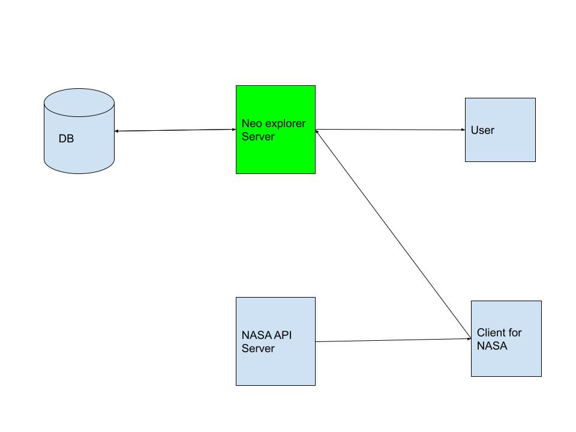

<!-- PROJECT LOGO -->
<br />


  <h3 align="center">NEO Explorer </h3>

  <p align="center">
     Near earth object explorer by Preeti for Data4life
    <br />
      </p>
</p>


<!-- TABLE OF CONTENTS -->
<details open="open">
  <summary>Table of Contents</summary>
  <ol>
    <li><a href="#About">About NEO Exlorer</a></li>
    <li><a href="#Techstack">Techstack</a></li>
    <li><a href="#System-architecture">System architecture</a></li>
    <li><a href="#Getting-Started">Getting Started</a></li>
    <li><a href="#Testing">Testing</a></li>
    <li><a href="#Contact">Contact</a></li>
  </ol>
</details>


## About


NEO Explorer is a backend application which helps you search near earth objects with [RESTFUL APIs](https://www.smashingmagazine.com/2018/01/understanding-using-rest-api/)

### Techstack 

All programming language, web frameworks, databases are the 
tools for a craftsperson called software engineer.
Most of these tools fits well for certain type of business problems.
Here the use case was to develop a small webserver with no specific 
scalability requirements.
I have used mentioned stack 


* [Python 3.8.2](https://www.python.org/downloads/release/python-382/) As Programming language for web server and client
* [Flask](https://flask.palletsprojects.com/en/2.0.x/) As Web Framework
* [SQlite](https://www.sqlite.org/index.html) As database
* [docker](https://www.docker.com/) For containerisation
* [Kubernetes](https://kubernetes.io/) For containerised deployment
* [HELM](https://helm.sh/docs/topics/charts/) As Kubernetes package manager

## System architecture



## Getting Started 
## Setting up Neo explorer server
### With docker 

I have pushed latest version of this app to docker hub repository. 
If you do not have docker installed on your system install it from [here](https://docs.docker.com/get-docker/).

Use below commands to pull and run docker container on port 80 of localhost

```
docker pull preety26/data4life:latest
docker run -p 80:80 preety26/data4life 
```

Now you should have application running on your local host.

To verify that docker instances are running use this command to check docker containers.
```
docker ps
```

### WIthout docker

1. If you do not want to use docker ensure you have python3.8 version 
installed on your system form [here](https://www.python.org/downloads/release/python-382/)

2. It's always a good practice to isolate environment of different applications.
For python applications virtual environment is a good way to ensure just that
Install [virtualenv from here](https://pypi.org/project/virtualenv/).

3. Once installed, create a virtualenv and activate it follow this [documentation](https://virtualenv.pypa.io/en/latest/#)

4. Install project dependencies using pip with this command

```
pip install -r requirements.txt
```

5. Use  below command to run flask application on default 5000
   ```sh
   flask run
   ```


## Setting up Client for NASA API server

1. Extract data4life.zip and change your directory to data4life
2. Set up virtual environment and install dependencies using
   ```shell
   pip install -r requirements.txt
   ```
3. Get a free API Key at [https://api.nasa.gov](hhttps://api.nasa.gov)
4. Clone the repo
   set above received api as environment variable using below command
   ```shell
   export NASA_API_KEY=<your_api_key_goes_here>
   ```

5. Please ensure correct endpoint of server is set using `NEO_SERVER_POST_ENDPOINT` 
environment variable.
   ```
   export NEO_SERVER_POST_ENDPOINT=<neo_server_post_endpoint_goes_here>
   ```

6. Run client app to populate database using API endpoints with data from NASA
   ```shell
   python main.py
   ```

## Testing
A wise engineer once said that `Something that is untested is broken.`
Well not always but most often.

I have used [pytest](https://docs.pytest.org/en/6.2.x/) to test the app.

Run tests with below command in project root and relax, pytest will do the job for you
```shell
pytest
```

I have not written extensive test cases, I would to add more tests there.

## Contact

Preeti Bhardwaj - [LinkedIn](www.linkedin.com/in/bhardwaj-preeti) - sharma.pittu101@gmail.com
